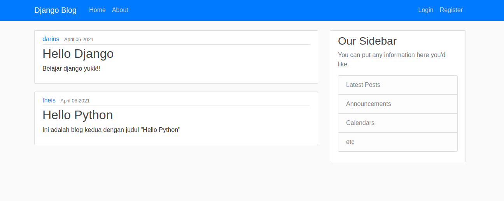

### Django App Blog

#### How to run This Project

* git clone https://github.com/antheiz/django-blog.git
* cd django-blog
* python -m venv python-env
* source python-env/bin/activate/
* pip install -r requirements.txt
* python manage.py runserver
* open your browser and typing _localhost:8000_

### Thank You
* By Theis Andatu
* With follow Guide on this Tutorial [YouTube](https://www.youtube.com/playlist?list=PL-osiE80TeTtoQCKZ03TU5fNfx2UY6U4p)
